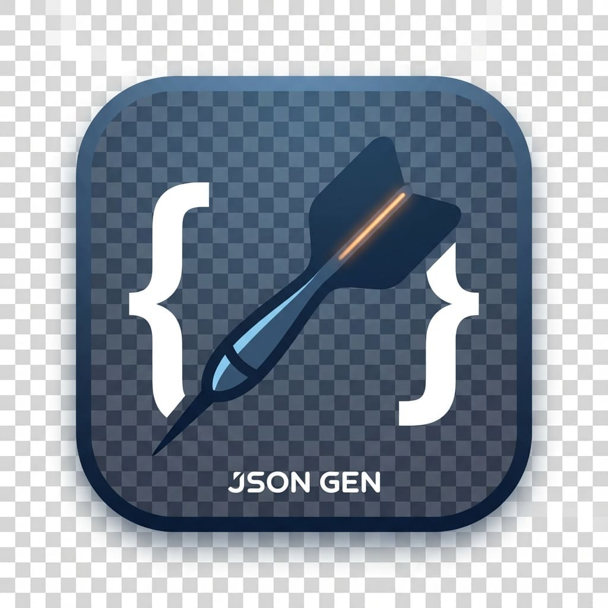

# Dart JSON Generator VS Code Extension



VS Code extension for generating Dart JSON serialization code using `dart_json_annotations`.

## ✨ Features

- **🎯 Context Menu Integration**: Right-click on any Dart file or folder in the explorer
- **📁 Separate Commands**: 
  - `Dart JSON: Generate for File` - Generate code for a single .dart file
  - `Dart JSON: Generate for Folder` - Generate code for all files in a folder
- **🎨 Custom Icons**: Visual icons in context menus for easy identification
- **📊 Progress Tracking**: Real-time progress indicator during generation
- **⚙️ Configurable**: Customize notifications, auto-refresh, and verbose output
- **🔍 Detailed Output**: Optional verbose logging in the output channel
- **🚀 Auto-Install Prompt**: Helpful prompts if dart_json_gen is not installed
- **♻️ Auto-Refresh**: Automatically refreshes the file explorer after generation

## 📦 Installation

### From Source

1. Open the extension folder in VS Code
2. Run `npm install` to install dependencies
3. Press `F5` to launch a new Extension Development Host window
4. In the new window, right-click on a Dart file or folder

### Package and Install

1. Install `vsce`: `npm install -g @vscode/vsce`
2. Package the extension: `vsce package`
3. Install the `.vsix` file: `code --install-extension dart-json-gen-1.0.0.vsix`


## Publish to marketplace

1. Run `vsce publish`
2. Follow the prompts to publish the extension to the marketplace
3. The extension will be published to the marketplace and can be installed from the marketplace

## 📋 Prerequisites

- **Dart SDK** installed
- **dart_json_annotations** package installed globally:
  ```bash
  dart pub global activate dart_json_annotations
  dart_json_gen --build  # First time only
  ```

## 🚀 Usage

### Method 1: Explorer Context Menu

1. **For a single file**:
   - Right-click on a `.dart` file in the VS Code explorer
   - Select **"Dart JSON: Generate for File"** (with 📄 icon)

2. **For a folder**:
   - Right-click on a folder in the VS Code explorer
   - Select **"Dart JSON: Generate for Folder"** (with 📁 icon)

### Method 2: Editor Context Menu

1. Open a `.dart` file in the editor
2. Right-click anywhere in the editor
3. Select **"Dart JSON: Generate for File"**

### Method 3: Command Palette

1. Press `Cmd+Shift+P` (Mac) or `Ctrl+Shift+P` (Windows/Linux)
2. Type "Dart JSON"
3. Select either:
   - **Dart JSON: Generate for File**
   - **Dart JSON: Generate for Folder**

## ⚙️ Configuration

Open VS Code settings and search for "Dart JSON Generator":

| Setting | Type | Default | Description |
|---------|------|---------|-------------|
| `dartJsonGen.autoRefresh` | boolean | `true` | Automatically refresh file explorer after generation |
| `dartJsonGen.showNotifications` | boolean | `true` | Show success/error notifications |
| `dartJsonGen.verboseOutput` | boolean | `false` | Show verbose output in the output channel |

### Example settings.json

```json
{
  "dartJsonGen.autoRefresh": true,
  "dartJsonGen.showNotifications": true,
  "dartJsonGen.verboseOutput": false
}
```

## 📝 Output Channel

View detailed logs in the **Dart JSON Generator** output channel:

1. Open the Output panel (`View` → `Output`)
2. Select **Dart JSON Generator** from the dropdown
3. Enable verbose output in settings to see detailed logs

## 🛠️ Development

```bash
# Install dependencies
npm install

# Compile TypeScript
npm run compile

# Watch mode (auto-compile on changes)
npm run watch

# Run extension in development mode
# Press F5 in VS Code
```

## 📸 Screenshots

### Context Menu for Files
Right-click on a `.dart` file to see the "Dart JSON: Generate for File" option with a 📄 icon.

### Context Menu for Folders
Right-click on a folder to see the "Dart JSON: Generate for Folder" option with a 📁 icon.

### Progress Notification
A progress notification appears during code generation showing real-time status.

## 🔧 Troubleshooting

### "dart_json_gen not found"

**Solution**: Install the package globally:
```bash
dart pub global activate dart_json_annotations
dart_json_gen --build
```

The extension will also show an "Install Now" button that opens a terminal with the install command.

### No context menu appears

**Solution**: Make sure you're right-clicking on:
- A `.dart` file (for file generation)
- A folder (for folder generation)

### Generation fails silently

**Solution**: 
1. Enable verbose output in settings
2. Check the **Dart JSON Generator** output channel
3. Look for detailed error messages

## 📄 Requirements

- **VS Code** 1.74.0 or higher
- **Dart SDK** 3.0.0 or higher
- **dart_json_annotations** package (global activation recommended)

## 📜 License

Distributed under the [MIT License](LICENSE).

## 🤝 Contributing

Issues and pull requests are welcome!

## 📚 Related

- [dart_json_annotations](https://github.com/djsmk123/dart_json_annotations)
- [Documentation](https://github.com/djsmk123/dart_json_annotations#readme)
